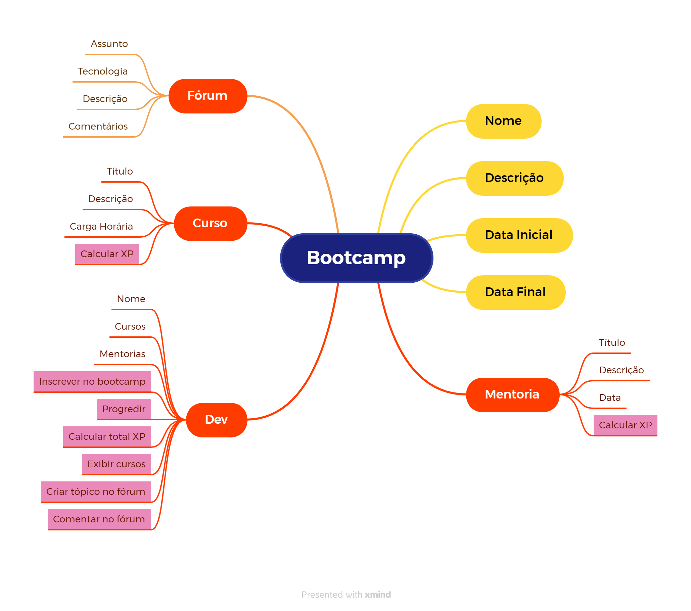

# DIO Project - POO

## ⚙️ Projeto de programação  orientada a objetos de um Bootcamp
O projeto de um Bootcamp foi realizado durante o Curso de Programação Orientada a Objetos da plataforma DIO.

A seguir, um diagrama representando os respectivos atributos, métodos e classes do projeto.

## 🛠️ Evoluções
Classe *Fórum*
Métodos *Criar tópico no fórum* e *Comentar no Fórum* (Classe Dev)